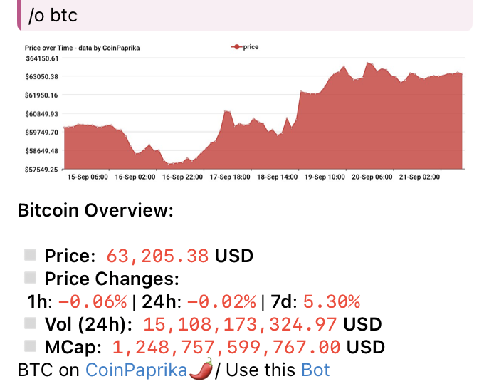

# CoinPaprika Telegram Bot

A Telegram bot that provides cryptocurrency data from CoinPaprika, with Prometheus integration for metrics tracking. The bot allows users to check prices, supply, volume, and charts for coins and tokens via simple commands.

## Features

- **Price Check**: Get the current price of a cryptocurrency.
- **Supply Check**: Check the circulating supply of a cryptocurrency.
- **Volume Check**: Get the 24-hour trading volume of a cryptocurrency.
- **Price Chart**: Fetch a chart for the cryptocurrency.
- **Source Code**: Share the source code repository of the bot.
- **Pro API Key Support**: If you have a CoinPaprika Pro API key, you can use it for enhanced features.

## Commands

| Command       | Description                                 |
|---------------|---------------------------------------------|
| `/start`      | Display the welcome/help message            |
| `/help`       | Display the list of commands                |
| `/o <symbol>` | Check the coin overview                     |
| `/p <symbol>` | Check the price of a coin                   |
| `/s <symbol>` | Check the circulating supply of a coin      |
| `/v <symbol>` | Check the 24-hour volume of a coin          |
| `/c <symbol>` | Fetch the price chart of a coin             |
| `/source`     | Get the link to the source code of this bot |

## Getting Started

### Prerequisites

- Go (Golang) 1.22 or higher
- Docker and Docker Compose
- Telegram Bot API token (create one via [BotFather](https://t.me/botfather))
- Prometheus (for tracking bot metrics, optional)
- **Optional**: CoinPaprika Pro API key (if you want to use the pro features)

### Installation

1. Clone the repository:

    ```bash
    git clone https://github.com/coinpaprika/telegram-bot-v2.git
    cd telegram-bot-v2
    ```

2. Install dependencies:

    ```bash
    go mod tidy
    ```

3. Create a `.env` file in the root directory by copying the provided `.env.example` file:

    ```bash
    cp .env.example .env
    ```

4. Fill in the `.env` file with your credentials, such as your Telegram Bot API token, CoinPaprika API key, and the desired metrics port:

    ```bash
    TELEGRAM_BOT_TOKEN=your-telegram-bot-token
    API_PRO_KEY=your-coinpaprika-pro-api-key # Optional
    METRICS_PORT=9090
    DEBUG=1
    ```

### Running the Bot with Docker

The bot is designed to be run using Docker. The Docker configuration automatically reads your `.env` file.

1. Build and run the bot with Docker Compose:

    ```bash
    docker-compose up --build
    ```

2. The bot will now be running and listening for Telegram updates. You can also view Prometheus metrics at `http://localhost:<METRICS_PORT>/metrics`.

### Running the Bot without Docker

1. Build the bot:

    ```bash
    go build -o coinpaprika-telegram-bot
    ```

2. Run the bot:

    ```bash
    ./coinpaprika-telegram-bot
    ```

3. The bot will now be running and listening for Telegram updates. You can also view Prometheus metrics at `http://localhost:<METRICS_PORT>/metrics`.

### Using the API Pro Key

If you have a CoinPaprika Pro API key, add it to the `.env` file under the `API_PRO_KEY` field. This will allow the bot to access additional CoinPaprika Pro features.

```bash
API_PRO_KEY=your-coinpaprika-pro-api-key
```

If you don't have a pro key, the bot will still work with standard CoinPaprika features.

### Metrics

The bot tracks the following metrics using Prometheus:

- **commands_processed**: Total number of commands processed by the bot.
- **messages_handled**: Total number of messages handled by the bot.
- **channels_count**: Number of unique Telegram channels the bot is active in.

You can scrape these metrics by visiting the `/metrics` endpoint at `http://localhost:<METRICS_PORT>/metrics`.

### Example Usage

Once the bot is running, you can interact with it via the following commands:

- `/o BTC`: Check the Bitcoin overview.
  
- `/p BTC`: Check the price of Bitcoin.
- `/s ETH`: Check the circulating supply of Ethereum.
- `/v DOGE`: Check the 24-hour volume of Dogecoin.
- `/c LTC`: Fetch the price chart of Litecoin.

## License

This project is licensed under the MIT License. See the [LICENSE](LICENSE) file for details.

## Contributions

Feel free to open issues or pull requests if you'd like to contribute to the project!

## Acknowledgments

- CoinPaprika for the API used in this bot.
- Prometheus for metrics tracking.
